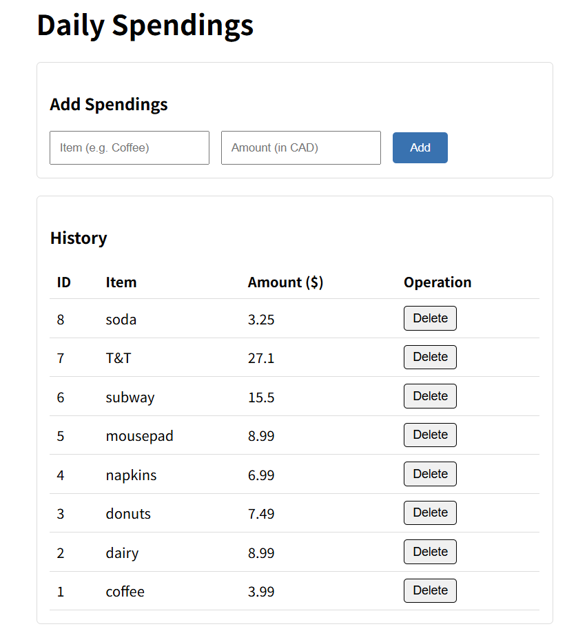
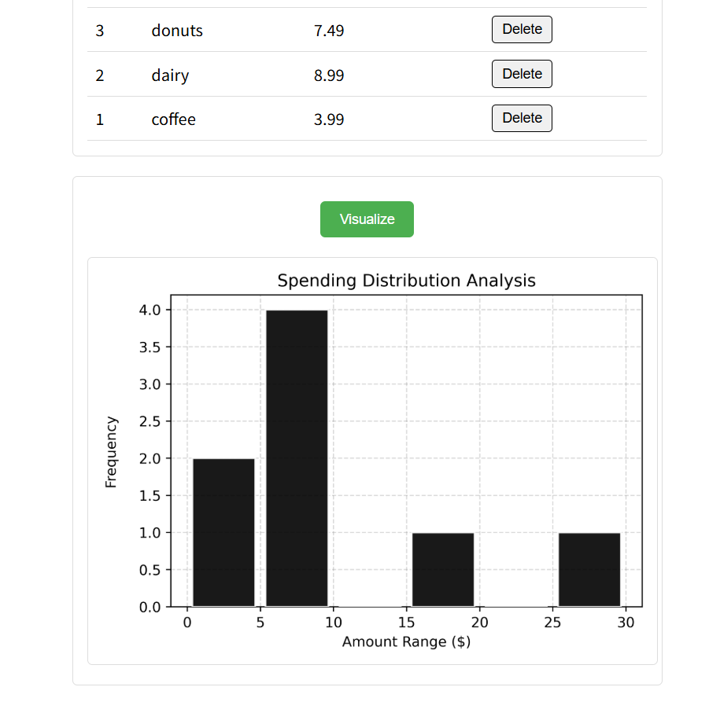

# PyFinance Tracker
A Full-Stack Spendings Tracing & Visualization Tool

Introduction:
**PyFinance Tracker** is a lightweight web application designed to help users track their daily cash flow and spending habits. 

It is built with **Flask**, **SQLite**, **Numpy**, and **Matplotlib**, and allows user to generate statistical visualizations of spending distributions. 


Screenshots:
<div align="center">
  
  
</div>


Key Features:
- Data Visualization:
    - Generate 500DPI histograms. 
    - Use Numpy for efficient data vectorization and dynamic binning. 
    - Use Matplotlib 'Agg' for thread-safe rendering. 
- Transaction Management:
    - Support **CRUD** operations for expense records. 
    - Defensive Programming: Implements server side validation and error handling. 
    - Parameters Unpacking: clean data passing between backend and frontend. 
- Clean user-interface:
    - Responsive ghost buttons for dangerous actions. 


Tech Stack:

    - Backend: Python, Flask
    - Database: SQLite3
    - Data Processing: Numpy, Matplotlib
    - Frontend: HTML, CSS, Jinja2 Templates


How to run locally

    1. Clone the repository
        git clone https://github.com/zjc-0680/PyFinance-Tracker.git
    2. Create virtual environment
        python -m venv venv
        Windows: venv/Scripts/activate
        Mac/Linux: source venv/bin.activate
    3. Install dependencies
        ```bash
        pip install -r requirements.txt
        ```
    4. Run the App
        In the terminal, enter:
        python app.py

    5. Enjoy the App:
        Open your browser and visit:
        `http://127.0.0.1:5000/`
    
Future Improvements:

    - Add user authentication
    - Implement weekly/monthly/yearly spending reports
    - Deploy to cloud platforms


Created by Juncheng Zhu - University of Waterloo
